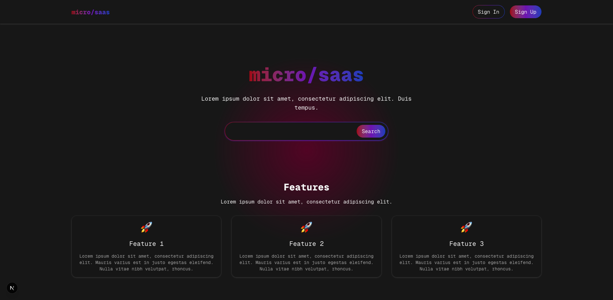

# `micro/saas`



## Table of Contents

- [`micro/saas`](#microsaas)
  - [Table of Contents](#table-of-contents)
  - [Techstack](#techstack)
  - [Folder Structure](#folder-structure)

## Techstack

1. 🟦 [TypeScript](https://www.typescriptlang.org/) – A typed superset of JavaScript that enhances code reliability and developer experience.
2. 📦 [pnpm](https://pnpm.io/) – A fast, efficient, and disk-saving package manager for JavaScript monorepos and projects.
3. 🧹 [ESLint](https://eslint.org/) – A pluggable linter for identifying and fixing code quality and style issues in JavaScript/TypeScript.
4. 🎨 [Prettier](https://prettier.io/) – An opinionated formatter that ensures consistent code style across your codebase.
5. 💨 [Tailwind CSS](https://tailwindcss.com/) – A utility-first CSS framework for building modern, responsive UIs quickly.
6. ⚡ [Next.js](https://nextjs.org/) – A React framework for building scalable, full-stack web apps with server-side rendering and API routes.
7. ⚙️ [Jest](https://jestjs.io/) – A powerful and widely used JavaScript testing framework with a great developer experience.
8. 🔗 [tRPC](https://trpc.io/) – Create fully typesafe APIs without code generation—perfect for TypeScript full-stack apps.
9. 🧱 [Zod](https://zod.dev/) – A TypeScript-first schema declaration and validation library, ideal for form validation and API contracts.
10. 🛢️ [Prisma](https://www.prisma.io/) – A modern ORM that simplifies database access with auto-generated, type-safe queries.
11. 🐳 [Docker](https://www.docker.com/) – A containerization platform that enables consistent development, testing, and deployment environments across systems.
12. 🔁 [Github Actions](https://github.com/features/actions) – A powerful CI/CD automation tool built into GitHub for running workflows on code changes, tests, deployments, and more.

## Folder Structure

```txt
├── public
│   ├── favicon.ico
│   ├── manifest.json
│   ├── robots.txt
│   └── sitemap.xml
├── src
│   ├── pages
│   │   ├── api
│   │   └── app
│   └── utils
├── .gitattributes
├── .gitignore
├── .node-version
├── .npmrc
├── .nvmrc
├── .prettierignore
├── .prettierrc.json
├── package.json
├── README.md
└── tsconfig.json
```
